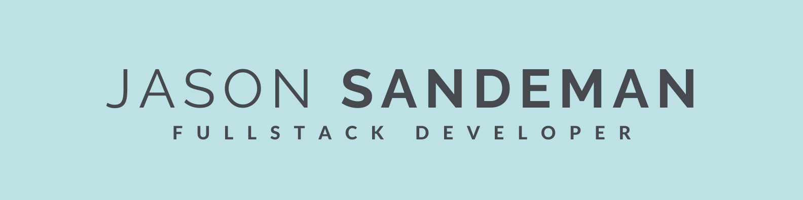

  

 

  

&nbsp;

 

<h1 align="center">Hi 👋, I'm Jason Sandeman</h1>

    
    
    
    

 

<h3 align="left">A passionate full stack developer from Queensland</h3>

🔭 I’m currently working on: **SpinTheYarn - a social worldbuilding platform for creative writers**

🌱 I’m currently learning: **Blitzjs**

👯 I’m looking to collaborate on: **anything react.js | next.js | blockchain (especially XRPL)**

🤝 I’m looking for help with: **SpinTheYarn**

⛳ Interests: **Golf | Snowboarding | Coding(#Reactjs #Nextjs) | Reading & Writing(#Scifi #Fantasy) | Crypto(#XRP #XLM #XDC #QNT #HBAR #ALBT)**

📫 How to reach me: **jw.sandeman@gmail.com | [twitter](https://twitter.com/jwsandeman) | [LinkedIn](https://www.linkedin.com/in/jason-sandeman-33268496/)**

⚡ Fun fact: **I spent 2 years living in Canada 🏂 on a working holiday**

 

<h3 align="left">Languages and Tools</h3>

                     

